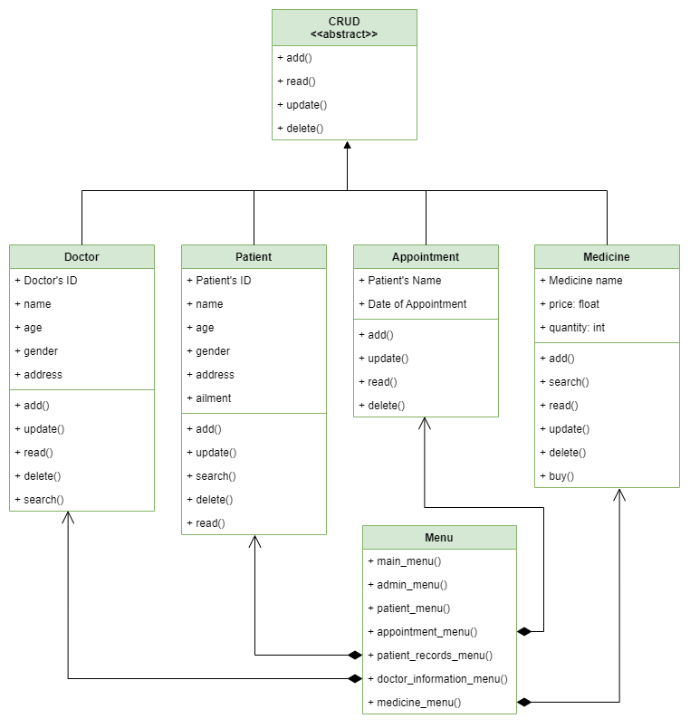

# **Clinic Management System**

This is a program that allows users to add, search, update and delete data. It can also save this datas in to a file.

## **Overview of the Program**
---
**Main Menu**   
- **Admin Menu**   
    In this option, the admin has an access to the medical records of the patient, information of the doctor, the medicine and appointment list.

    - **Patient's Record**   
    The admin can add, search, update and delete patient's record.
        * Name
        * Age
        * Gender
        * Address
        * Ailment

    - **Doctor's Information**   
    The admin can add, search, update and delete doctor's information.
        * Name
        * Age
        * Gender
        * Address

    - **Medicine List**   
    The admin can add, search, update and delete in the list of medicine.
        * Name of Medicine
        * Price
        * Quantity

    - **Appointment List**   
    The admin can add, update, delete and display appointment lists.
        * Patient's Name
        * Date of Appointment   
        
- **Patient Menu**   
    In this option, the patient can make an appointment and buy a medicine that is prescribed by the doctor.

    - **Make an Appointment**
    - **Buy Medicine**

## **Prerequisites**   
---
Make sure you have the following prerequisites:   
* Maskpass - You're going to use the [Maskpass Module](https://pypi.org/project/maskpass/) to hide the password during input time.   
```
pip install maskpass
```

## **UML Diagram**
---
This is the diagram for our program.   

