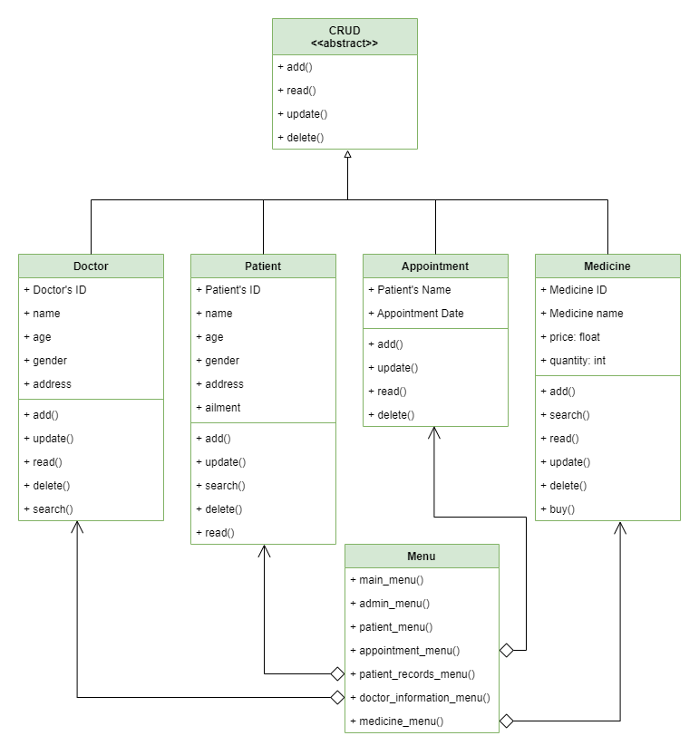

# Clinic Management System
**Final Project in CS 121 - Advanced Computer Programming**   
Instructor: Dr. Francis Jesmar P. Montalbo   
Group Members:
- Garcia, Berlie Jaye | [@brwla](https://github.com/brwla)
- Dancalan, Harold | [@HaroldDancalan](https://github.com/HaroldDancalan)
- Rosalem, Kiara Marie | [@kiararosalem](https://github.com/kiararosalem)
- Umblas, Casandra | [@CasandraUmblas](https://github.com/CasandraUmblas)

## Self-Assessment
This is our grade to our own work according to the [rubrics](images/Rubrics.png) provided:

| Metric             | 4 | 3 | 2 | 1 |
|--------------------|---|---|---|---|
| Code Reusability   |   | ✓ |   |   |
| Maintainability    | ✓ |   |   |   |
| Scalability        |   | ✓ |   |   |
| Execution          |   | ✓ |   |   |
| Originality        | ✓ |   |   |   |
| Overall Impression | ✓ |   |   |   |

## General Information
This is a program that uses the CRUD System and developed using the Python Programming Language. It can also save the datas into a JSON file. We utilized OOP Principles like Inheritance, Abstraction and Polymorphism in this program. It also has error handling features to catch all of the possible errors that may occur.       

## Usage
Upon running the program using the driver.py, the user must choose if they want to go to the admin or patient menu. 
- **Admin Menu**   
    In this Menu, the admin must input the password to have an access to the medical records of the patient, information of the doctor, the medicine and appointment list.

    - **Patient's Record**   
    The admin can add, search, update and delete patient's records which contains the Name of the Patient, Age, Gender, Address, and their Ailment.

    - **Doctor's Information**   
    The admin can add, search, update and delete doctor's information which contains the Doctor's Name, Age, Gender, and Address.

    - **Medicine List**   
    The admin can add, search, update and delete in the list of medicine which contains the Name of the Medicine, Price, and Quantity.

    - **Appointment List**   
    The admin can add, update, delete and display appointment lists which contains the Patient's Name, and Date of their Appointment.  
        
- **Patient Menu**   
    In this Menu, the patient can make an appointment and buy a medicine that is prescribed by the doctor.

## Prerequisites
Make sure you have the following prerequisites:   
* Maskpass - You're going to use the [Maskpass Module](https://pypi.org/project/maskpass/) to hide the password during input time.   

### Installation
Use the package manager [pip](https://pip.pypa.io/en/stable/) to install maskpass.
```
pip install maskpass
```

## UML Diagram
This is the diagram for our program.   



## Video Demo and Explanation
Click the image to watch the video.
[](https://youtu.be/thM-asuwKtQ)